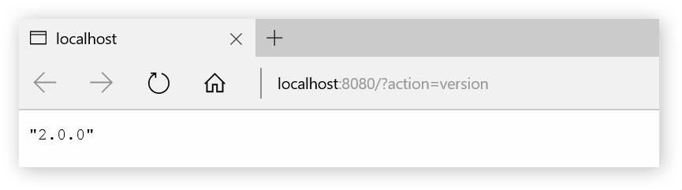
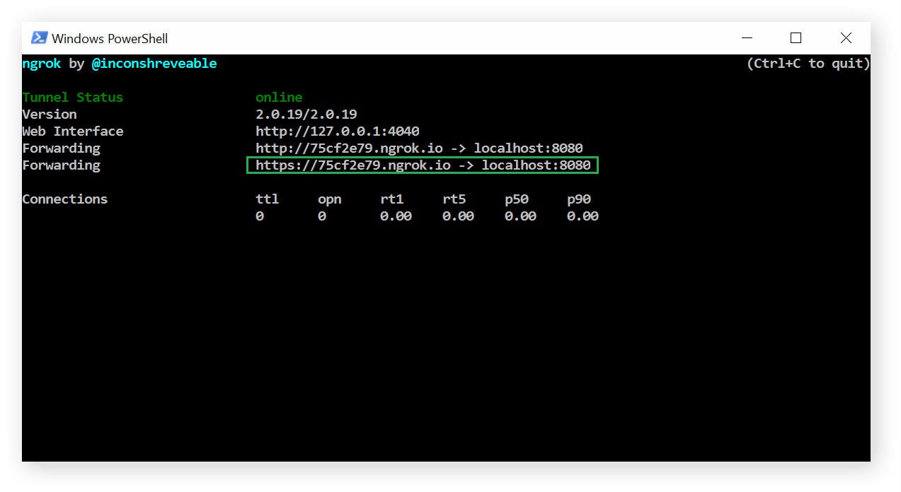

**********
Quickstart
**********

In this quick guide, you'll learn how to install, configure, and run Sloth CI. You'll also create and extend your first Sloth CI app.

Installation
============

**Sloth CI** requires Python 3.4 or better and works on Linux, Windows, and Mac OS X [#legacy-python]_.

Install Sloth CI and the :ref:`GitHub validator <github-validator>` with pip [#global-install]_:

.. code-block:: bash

    $ pip install sloth-ci sloth-ci.validators.github

Now you can invoke the :doc:`sci commands <cli>` and create apps triggered by GitHub pushes.

However, if you call ``sci`` now, it will fail:

.. code-block:: bash

    $ sci
    Please run inside a dir with "sloth.yml" or specify the server config with "-c."

That's because you need a *server config*.

Server
======

**Server config** is a YAML file, usually called *sloth.yml*, with the Sloth CI server settings. Minimally, it holds host, port, and credentials to access the API, but there's a lot more you can fine-tune (see the :doc:`full reference <server-config>`).

Create a file called :download:`sloth.yml <quickstart-samples/sloth.yml>` in any directory:

.. literalinclude:: quickstart-samples/sloth.yml
    :language: yaml

Run :ref:`sci start <cli-start>` in this directory, and Sloth CI will start as a daemon on http://localost:8080:

.. code-block:: bash

    $ sci start
    Starting Sloth CI on http://localhost:8080

Verify that it's really running by going to http://localhost:8080?action=version in your browser. When promtpted, enter the login and password from the server config. You should see your Sloth CI version [#api]_:

Now, lets create your first *Sloth CI app*.

Apps
====

**Sloth CI app** represents a job: build docs, run tests, and so on. Each app has its own config and listens on its own URL path, called a *listen point*. You can have as many apps on a single server as you want.

Lets create a simple app that listens to a GitHub repository and appends timestamp into a file on every push.

Create a file called :download:`timestamper.yml <quickstart-samples/timestamper.yml>`:

.. literalinclude:: quickstart-samples/timestamper.yml
    :language: yaml

This is a minimal :doc:`app config <app-config>`. Create the app from it with :ref:`sci create <cli-create>`:

.. code-block:: bash
    
    $ sci create timestamper.yml
    App "timestamper" created
    App "timestamper" bound with config file "~/timestamper.yml"

The app is now listening for incoming payload from GitHub on http://localhost:8080/timestamper. However, GitHub can't send you payload on localhost; you need to make the app reachable from the Internet. One easy way to do it is to use `ngrok <https://ngrok.com/>`_ [#public-server]_:

.. code-block:: bash

    $ ngrok http 8080

The app is now ready to receive push notifications from GitHub. Let's create a webhook on GitHub to send the notifications.

Go to your repository settings, switch to *Webhooks & services*, and click *Add webhook*:

.. image:: images/repo-settings.png

Enter the public URL of your app: take the URL generated by ngrok and add the app's listen point to it. Leave other settings as they are and click *Add webhook*:

.. image:: images/add-webhook.png

GitHub will send a ping event to verify that your app is properly configured. Run :ref:`sci logs timestamper <cli-logs>`. The last record should be ``Valid payload received``—this means that your app successfuly received the ping payload from GitHub:

.. code-block:: bash

    $ sci logs timestamper

    Timestamp                 Message
    ------------------------  -----------------------------------------
    Mon Oct 26 22:43:50 2015  Valid payload received
    Mon Oct 26 22:43:33 2015  Bound with config file ~/timestamper.yml
    Mon Oct 26 22:43:33 2015  Listening on timestamper

However, the app didn't execute the action we wanted it to—write to *timestamps.txt*. This is because ping is not a real event; you need a real *push* to trigger actions.

Edit any file in the repo; commit and push your changes. In a moment, GitHub will send a push event; your app will receive and validate it and execute your action. Run ``sci logs timestamper`` again:

.. code-block:: bash

    $ sci logs timestamper

    Timestamp                 Message
    ------------------------  -----------------------------------------
    Mon Oct 26 22:54:42 2015  Completed 1/1
    Mon Oct 26 22:54:42 2015  Finished
    Mon Oct 26 22:54:40 2015  Executing action: date >> timestamps.txt
    Mon Oct 26 22:54:40 2015  Valid payload received
    Mon Oct 26 22:43:50 2015  Valid payload received
    Mon Oct 26 22:43:33 2015  Bound with config file ~/timestamper.yml
    Mon Oct 26 22:43:33 2015  Listening on timestamper

Check *timestamps.txt* to see that the timestamp was indeed appended:

.. code-block:: bash

    $ cat timestamps.txt

    Mon Oct 26 22:43:33

It works!

Calling ``sci logs`` from a particular directory to get app logs is kind of sad. What about proper, greppable text logs? Worry not, they're easy to add—there's an *extension* for it.

Extensions
----------

**Extensions** add new features to Sloth CI. Some work on the server level (like :ref:`Robots.txt <ext-robots-txt>`), some work on the app level (like :ref:`File Logs <ext-file-logs>`, which we'll use right now), some work on both (sorry, no example yet, but there's nothing impossible about it). In fact, :doc:`Sloth CI's API <api>` is implemented as an extension.

To add text logs to an app, you need the File Logs extension. Install it with pip:

.. code-block:: bash

    $ pip install sloth-ci.ext.file_logs

Enable it in your app:

.. literalinclude:: quickstart-samples/timestamper-logged.yml
    :emphasize-lines: 11-16
    :language: yaml
    :caption: :download:`timestamper-logged.yml <quickstart-samples/timestamper-logged.yml>`

To apply the changes in the config, reload it with :ref:`sci reload timestamper <cli-reload>`:

.. code-block:: bash

    $ sci reload timestamper

    App "timestamper" removed
    App "timestamper" created
    App "timestamper" bound with config file "~/timestamper.yml"

Now initiate another push to the repo and see check the file */var/log/sloth-ci/ts_debug.log*:

.. code-block:: bash

    $ cat /var/log/sloth-ci/ts_debug.log

    2015-10-26 23:46:15,588 |                    timestamper |       INFO | Listening on timestamper
    2015-10-26 23:46:15,660 |                    timestamper |       INFO | Bound with config file ~/timestamper.yml
    2015-10-26 23:46:34,110 |                    timestamper |      DEBUG | Payload received from 192.30.252.42 - GitHub-Hookshot/8894fa3
    2015-10-26 23:46:34,143 |                    timestamper |      DEBUG | Payload validated. Branch: {'master'}
    2015-10-26 23:46:34,152 |                    timestamper |       INFO | Valid payload received
    2015-10-26 23:46:34,165 |              timestamper.build |      DEBUG | Triggered, actions in queue: 1
    2015-10-26 23:46:34,190 |               timestamper.exec |      DEBUG | Params: {'branch': {'master'}}
    2015-10-26 23:46:34,198 |               timestamper.exec |       INFO | Executing action: date >> timestamps.txt
    2015-10-26 23:46:36,081 |               timestamper.exec |      DEBUG | stdout:

    2015-10-26 23:46:36,090 |               timestamper.exec |      DEBUG | stderr:
    2015-10-26 23:46:36,101 |               timestamper.exec |       INFO | Finished
    2015-10-26 23:46:36,113 |              timestamper.build |       INFO | Completed 1/1

You can customize the format and level of your logs and make them rotating. :doc:`Learn more <extensions>` about this and other extensions.

.. rubric:: Read Next

-   Find practical recipes in the :doc:`cookbook <cookbook/index>`.
-   Learn more about :doc:`server <server-config>` and :doc:`app configs <app-config>`, :doc:`validators <validators>`, and :doc:`extensions <extensions>`.
-   Develop your own :doc:`validators <dev/validator>` and :doc:`extensions <dev/extension>`.

.. rubric:: Footnotes

.. [#legacy-python] Backporting to Python 3.2 and 2.7 is in progress. :doc:`Learn more <legacy>`.

.. [#global-install] It's usually a good idea to install Python packages in virtual environments. However, since Sloth CI is a system tool, you'll find it more convenient to install it globally.

.. [#api] :doc:`Learn more <api>` about this and other API actions.

.. [#public-server] Of course, when you deploy Sloth CI on a public server, you don't need ngrok.
